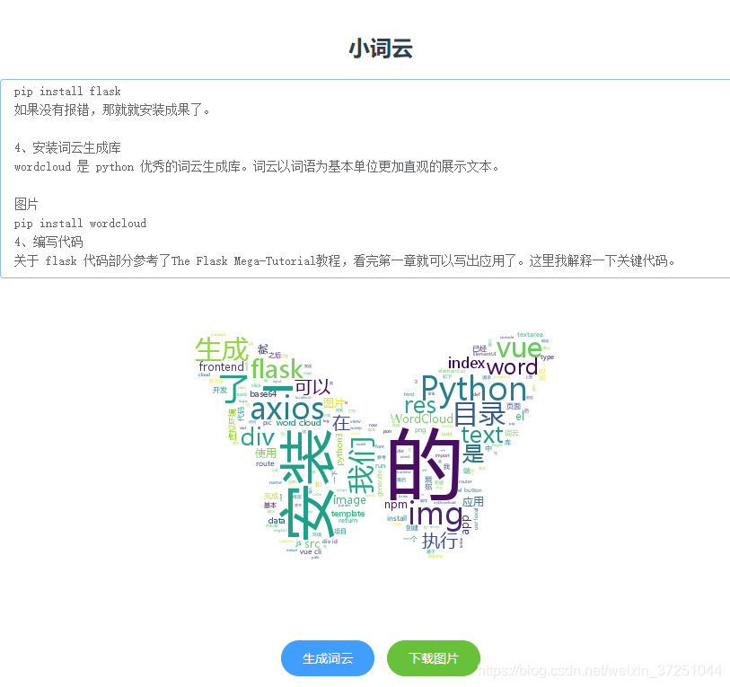

# Python的Web框架Flask + Vue 生成漂亮的词云
目录：
```buildoutcfg
.
├── backend
│   ├── hello.py  # 后端代码
│   ├── msyh.ttf  # 中文字库
│   ├── bg.jpg    # 词云背景形状
│   └── test.png  # 生成的词云图片
└── frontend
    ├── README.md
    ├── build
    ├── config
    ├── dist
    ├── index.html
    ├── node_modules
    ├── package-lock.json
    ├── package.json
    ├── src
    │   ├── router
    │   │   └── index.js    # 需要修改为 WordCloud.vue
    │   ├── main.js         # 需要新增element UI 和 axios
    │   └── WordCloud.vue   # 为我们新增的页面
    └── static
```
生成的词云效果：



参考：[实战：Flask + Vue 生成漂亮的词云](https://cloud.tencent.com/developer/article/1591257)

0.python依赖安装
```buildoutcfg
pip install -r requirements.txt
```

1.前端打包资源
```buildoutcfg
cd frontend
npm run build
```

执行完成后会将资源打包到dist目录。

2.后端运行：
```buildoutcfg
cd backend
python hello.py
```
